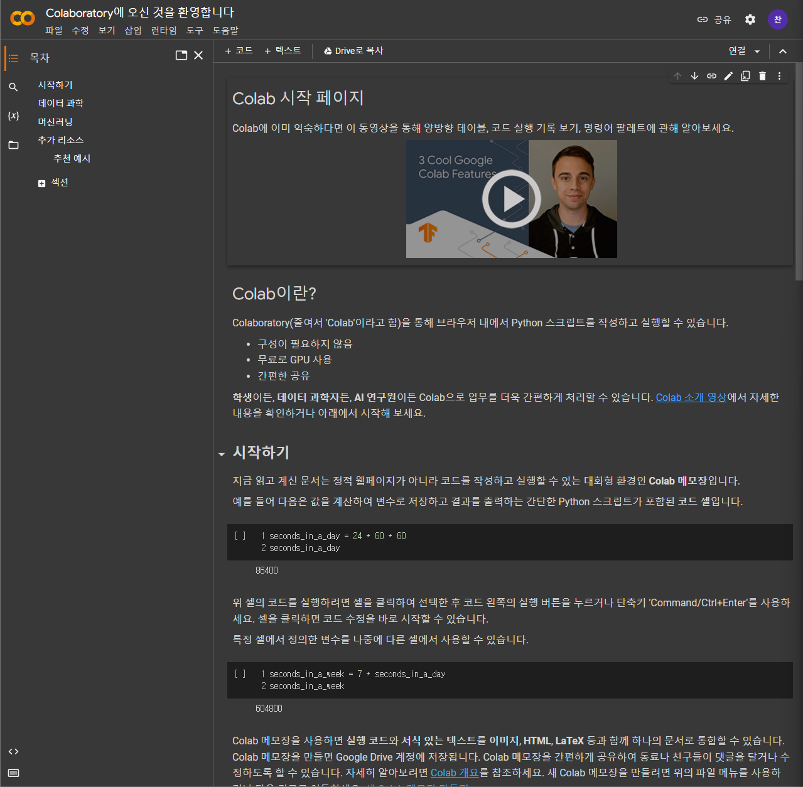
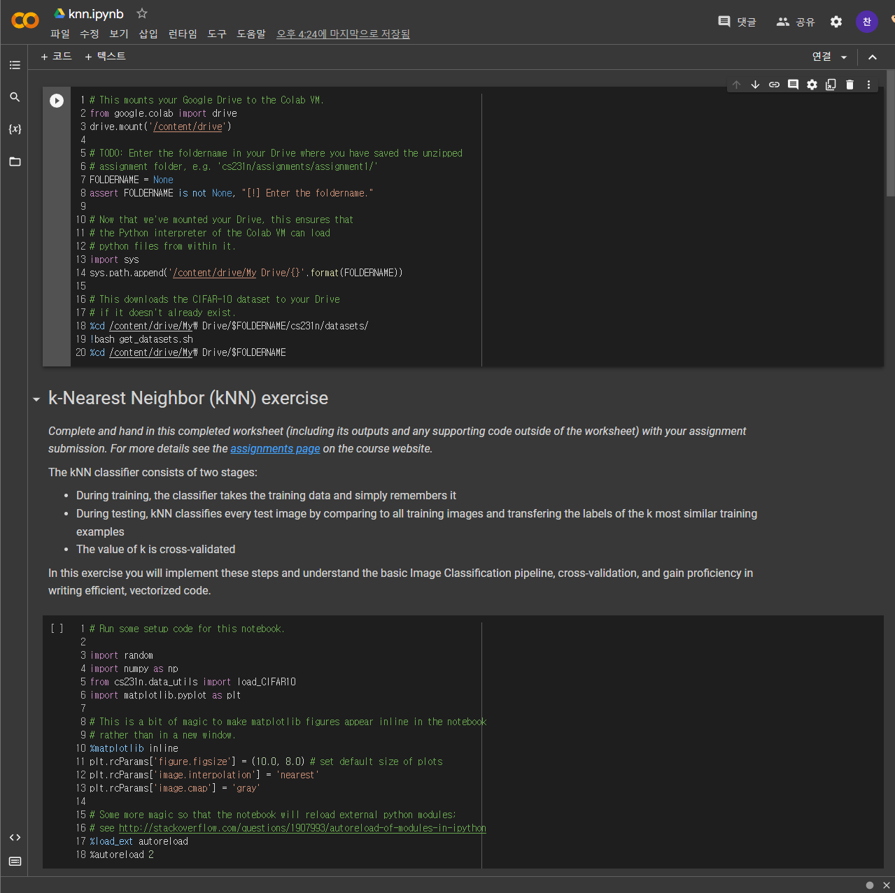
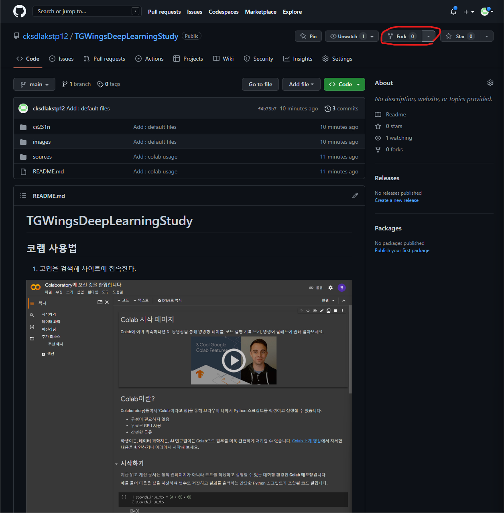
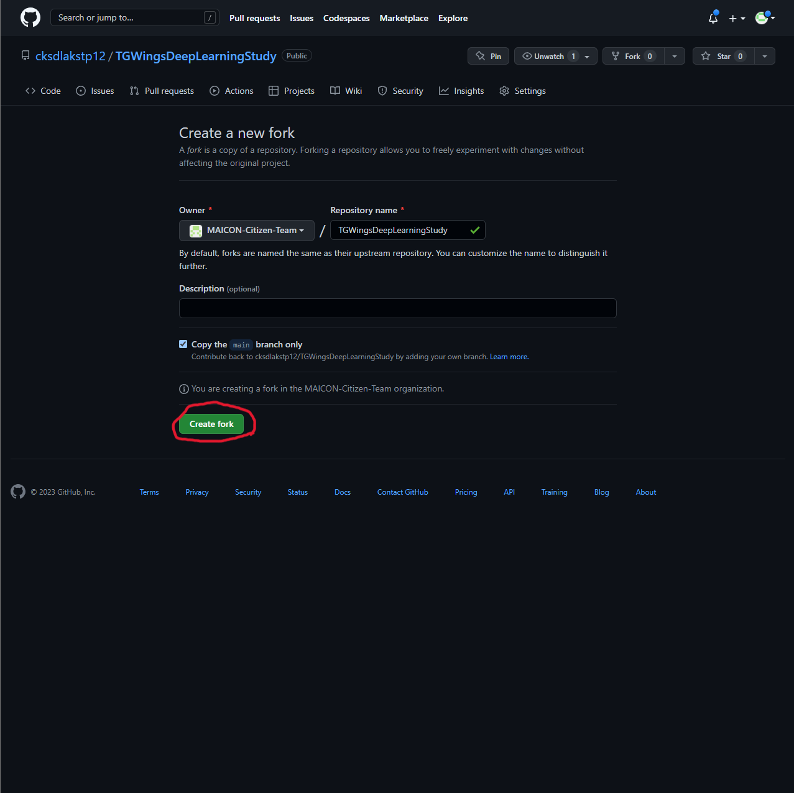
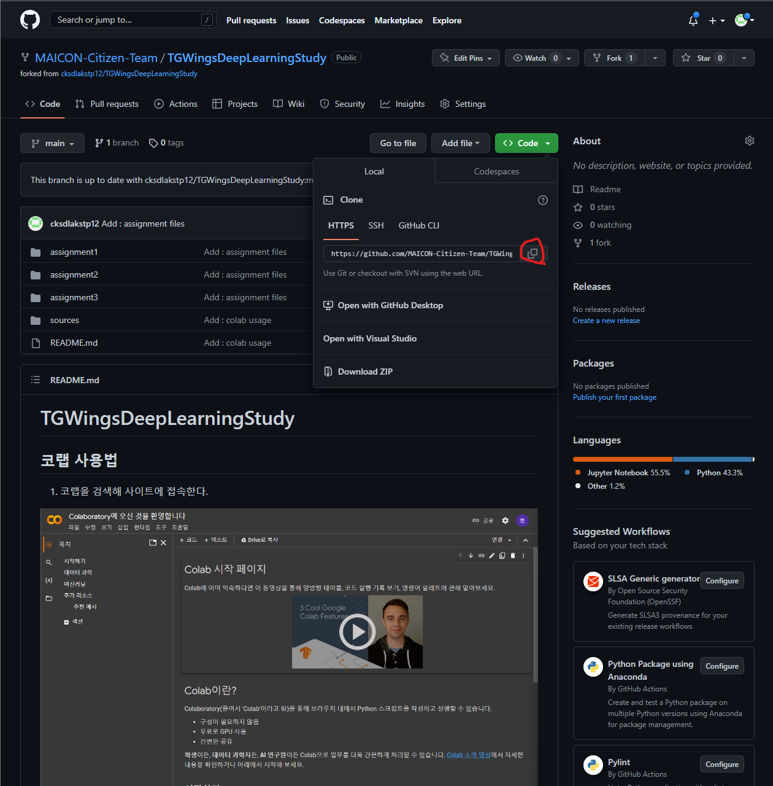
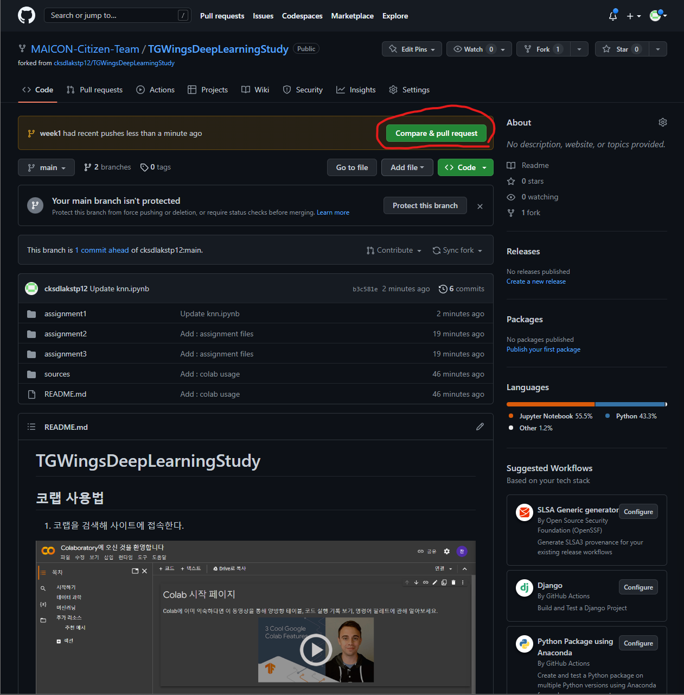
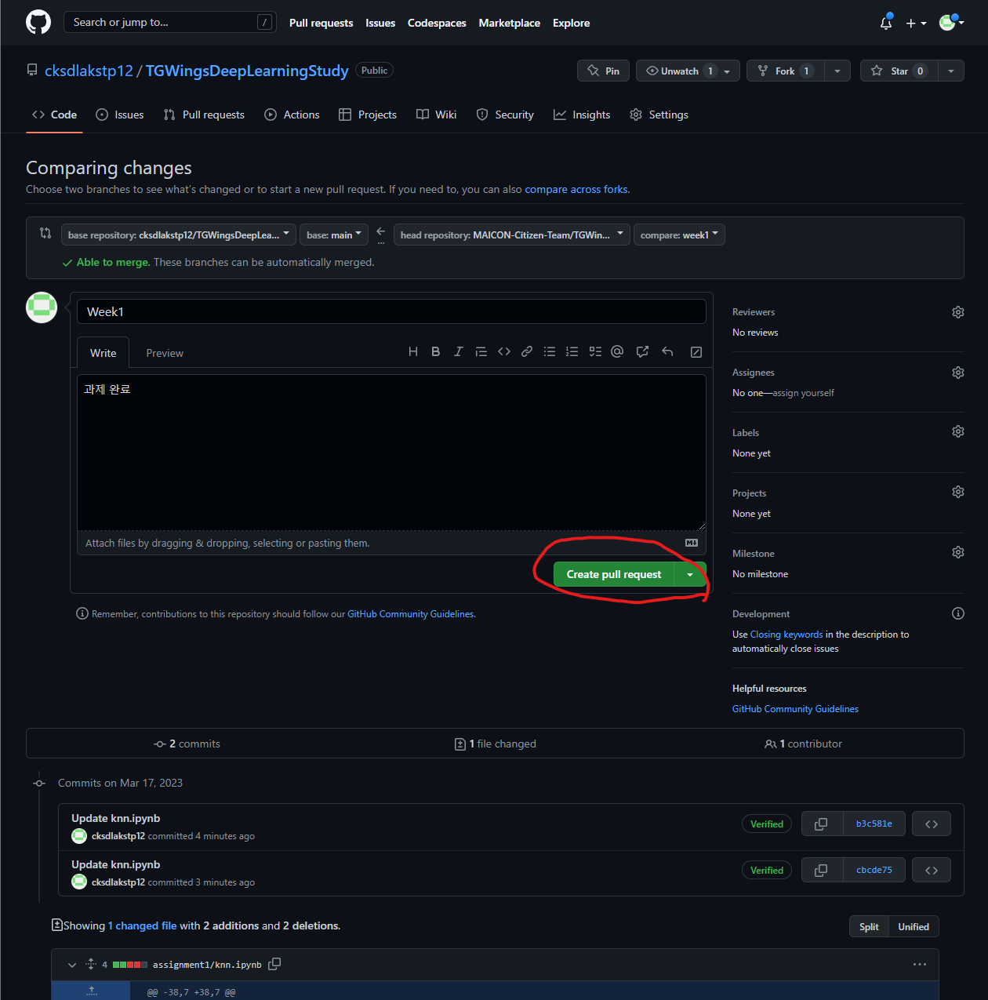
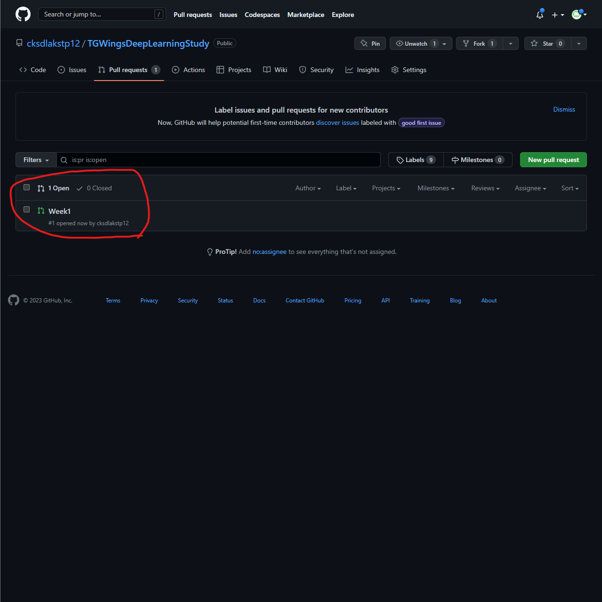

# 코랩 사용법

1.  코랩을 검색해 사이트에 접속한다.



2. '파일' -> '노트 업로드' 선택 후 업로드할 .ipynb 파일을 드래그&드롭하거나 '파일 선택' 버튼을 눌러 선택한다.


3. 업로드가 완료되면 자동으로 업로드한 파일이 열린다. 열린 파일에서 작업을 하면 된다.



# github를 사용해 과제 제출하는 방법

1. https://github.com/cksdlakstp12/TGWingsDeepLearningStudy/tree/main에 접속하여 원격 저장소를 Fork(나의 github에 그대로 복사)한다.



2. Fork 버튼을 누르면 저장소 생성 창이 나오는데, 그냥 'Create fork' 버튼을 눌러 내 github에 복사해온다.



- 위 명령어를 이용해서 원격 저장소를 자신의 컴퓨터로 복사해온다.

3. 복사가 완료되면 Fork한 저장소로 자동으로 이동하는데 '<> Code' -> 'HTTPS' 에서 복사 버튼을 눌러 주소를 복사해 아래의 코드를 컴퓨터 터미널을 열어 입력한다.

- ```git clone (복사해온 주소)```



4. ```cd TGWingsDeepLearningStudy```

- 위 명령어를 입력해 복사해온 폴더로 이동한다.

5. ```git branch -c week1```

- 위 명령어를 수행하면 week1 브랜치를 생성하고 바로 week1 브랜치로 이동하게 된다. 나중에는 week2 등으로 이름을 바꿔서 계속하면된다.
- 주의할 점은 main 브랜치에서 위 명령어를 수행해야한다는 점이다. 
- ```git switch main``` 명령어를 수행해서 꼭 main 브랜치로 이동 후 하도록 하자.

6. 해당 주차의 파일에서 과제를 수행한다.

7. 과제가 끝났다면,

- ```git status```로 변경된 파일을 확인하고
- ```git add *```로 변경된 파일을 github으로 보낼 준비를 한 다음,
- ```git commit -m '커밋 메세지'```로 github에 파일을 보내주면 된다. 커밋 메세지는 본인이 원하는데로 해도 상관없다.

8. github로 돌아가서 Fork한 저장소로 가보면 'Compare & pull request'라는 버튼이 생긴걸 볼 수 있다.



9. 'Compare & pull request' 버튼을 눌러서 'pull request' 생성 페이지로 이동 후, 대충 내용을 적은 다음 'Create pull request' 버튼을 눌러 pull request를 보내면 끝!



10. Fork 해온 원래 주인의 저장소의 Pull requests 페이지로 가보면 내가 보낸 pull request를 볼 수 있다.



11. 1번에서 4번 까지는 초기 설정이므로 1주차 이후로는 5번에서 10번 항목만 반복하면 된다.

